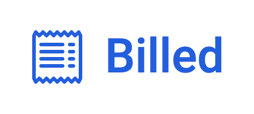

<a name="readme-top"></a>
<!-- PROJECT LOGO -->
<br />
<div align="center">
  <a href="">
    
  </a>

<!-- TABLE OF CONTENTS -->
<details>
  <summary>Table des matières</summary>
  <ol>
    <li><a href="#a-propos-du-projet">À propos du projet</a></li>
    <li><a href="#langagesutilises">langages Utilisés</a></li>
    <li><a href="#installation">Installation</a></li>
    <li><a href="#contact">Contact</a></li>
  </ol>
</details>


<!-- ABOUT THE PROJECT -->
## À propos du projet

Billed est le projet 9 de ma formation OpenClassroom.

Mission : Vous êtes développeur front-end chez Billed, une entreprise qui produit des solutions Saas destinées aux équipes de ressources humaines.

Ce projet nous confie la tâche de débugger et tester une application et donc travailler sur des tests unitaires et d'intégration en JavaScript et effectuer des tests end-to-end manuels. 

La mission principale sera de corriger les bugs d’un système RH et de finaliser les tests.

Elaboration également un plan de test end-to-end manuel pour assurer le bon fonctionnement du parcours employé de l'application.


 


## Langages utilisés et autres technologies utilisées


## Installation

1. Clonez le repository de l'application
   ```sh
   git clone https://github.com/AurelieDuynslaeger/Billed-App-OCR-Project8.git
   ```

2. Suivez les instructions des 2 README
  
## Contact

Aurélie D. - [GitHub](https://github.com/AurelieDuynslaeger/)

<!-- MARKDOWN LINKS & IMAGES -->
